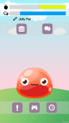

# Jelly Pal
Jelly Pal is an interactive friend who lives in your phone and helps manage your mental health. You can talk to your Jelly Pal and feed it, just like a real pet. Jelly Pal even has two games, a rhythm game to distract you and a breathing game to help deal with panic attacks. You can also schedule reminders so that the Jelly Pal will remind you when to take your medication.



## Libraries
Provide a list of **ALL** the libraries you used for your project. Example:

**google-gson:** Gson is a Java library that can be used to convert Java Objects into their JSON representation. It can also be used to convert a JSON string to an equivalent Java object. Source [here](https://github.com/google/gson)

## Installation Notes
Installation instructions for markers.

## Code Examples
You will encounter roadblocks and problems while developing your project. Share 2-3 'problems' that your team solved while developing your project. Write a few sentences that describe your solution and provide a code snippet/block that shows your solution. Example:

**Problem 1: We needed a method to calculate a Fibonacci sequence**

A short description.
```
// The method we implemented that solved our problem
public static int fibonacci(int fibIndex) {
    if (memoized.containsKey(fibIndex)) {
        return memoized.get(fibIndex);
    } else {
        int answer = fibonacci(fibIndex - 1) + fibonacci(fibIndex - 2);
        memoized.put(fibIndex, answer);
        return answer;
    }
}

// Source: Wikipedia Java [1]
```

## Feature Section
List all the main features of your application with a brief description of each feature.

## Final Project Status
The final version of our project has achieved all out expected goals. We have some games, some chat functionality, and scheduling. However for this project to be released more work should be done. Jelly Pal would benefit from the interactivity of many of the bonus functionality. The most important next step for the project would be to improve the chat feature to have chatbot functionality. Bonding with the jelly is the key idea this application is built around and improved chatting would benefit that.

#### Minimum Functionality
- Home screen (Completed)
- Tracking interactions (Completed)
- Microphone based game (Completed)
- Basic dialog (Completed)
- Notifications (Completed)

#### Expected Functionality
- Calendar (Completed)
- Rhythm game (Completed)
- Reactions (Completed)
- Responses (Completed)

#### Bonus Functionality
- Environment effects (Completed)
- Additional games (Not Implemented)
- Bluetooth connectivity (Not Implemented)
- Chatbot level interaction (Not Implemented)

## Sources
Use IEEE citation style.
What to include in your project sources:
- Stock images
- Design guides
- Programming tutorials
- Research material
- Android libraries
- Everything listed on the Dalhousie [*Plagiarism and Cheating*](https://www.dal.ca/dept/university_secretariat/academic-integrity/plagiarism-cheating.html)
- Remember AC/DC *Always Cite / Don't Cheat* (see Lecture 0 for more info)

[1] "Java (programming language)", En.wikipedia.org, 2018. [Online]. Available: https://en.wikipedia.org/wiki/Java_(programming_language).
